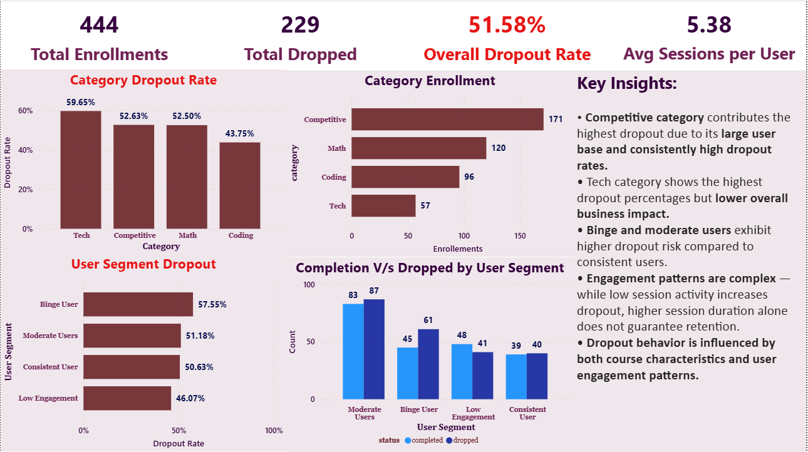
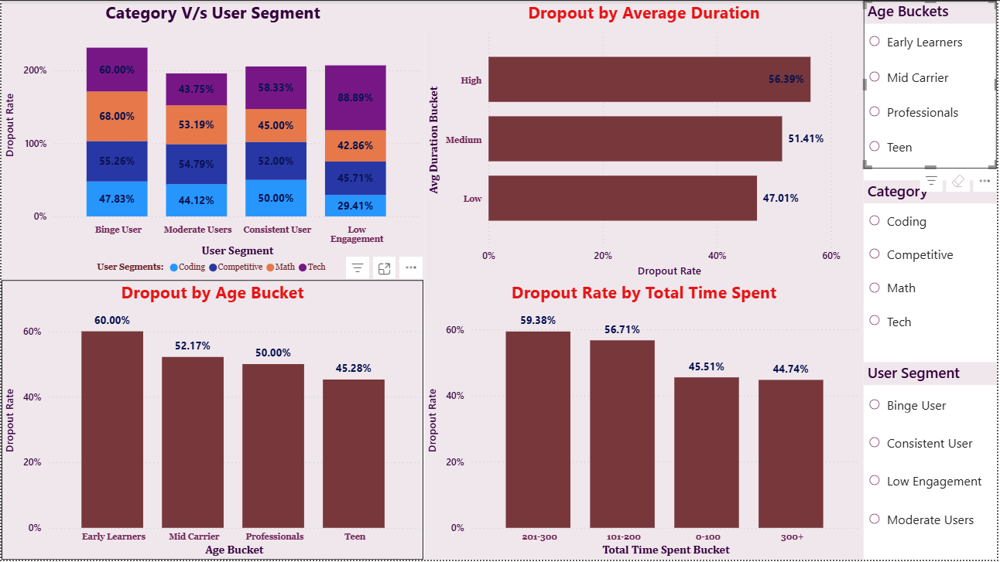

# EduMax Dropout Analysis

## 📌 Business Problem
Understanding why users drop out of online courses and identifying behavioral patterns affecting retention and engagement.

---

## 📊 Project Objective
Analyze multi-source EdTech platform data to:

- identify churn drivers
- study user engagement behavior
- build behavioral segmentation
- generate actionable business insights

---
## 🛠 Tools & Technologies
- Python (Pandas, NumPy)
- Power BI
- Data Visualization
- Exploratory Data Analysis (EDA)
- KPI Analysis

---
## 📂 Dataset Used
- users
- sessions
- enrollments
- courses
- payments
- assessments

---

## ⚙️ Key Analysis Performed
- Data cleaning & preprocessing
- Feature engineering
- Behavioral segmentation
- Churn analysis
- KPI analysis
- Dashboard development

---

## 🔍 Key Business Insights

✅ High engagement ≠ high retention
Users with very high session duration (~65+ mins) showed significantly higher dropout rates.

✅ Multi-stage churn behavior identified
Peak dropout occurred during:
- early engagement (3–4 sessions)
- mid engagement (100–300 mins)
  
✅ Behavioral segmentation revealed burnout-driven churn
High-intensity irregular learners had higher churn than low-engagement users.

✅ Competitive courses contributed highest total dropouts
Despite not having the highest dropout rate individually.

---

## 📈 Dashboard

---
## 📊 Power BI Dashboards

Download and open the dashboard in Power BI Desktop:
[Download Dashboard](dashboard/Edumax_Dashboard.pbix)

---

## 🚀 Business Impact
This analysis helps:
- identify retention gaps
- optimize engagement strategies
- improve course-level performance
- support data-driven business decisions

---

## 🔮 Future Improvements
- Predictive churn modeling
- Time-series engagement analysis
- Personalized retention strategy recommendations
